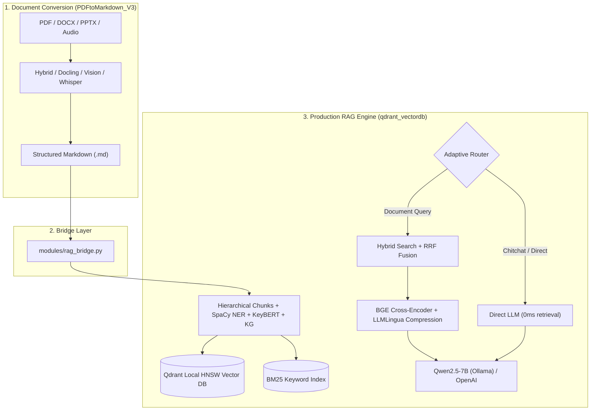

# Production RAG: Pure Terminal Multi-Modal Document Engine

A production-grade, terminal/CLI-based multi-modal Retrieval-Augmented Generation (RAG) system integrating document conversion ([`PDFtoMarkdown_V3`](file:///c:/Users/Vaishnav%20M/Projects/production_rag/PDFtoMarkdown_V3)) and hybrid vector/sparse retrieval ([`qdrant_vectordb`](file:///c:/Users/Vaishnav%20M/Projects/production_rag/qdrant_vectordb)).

---

## 1. Architecture



---

## 2. Quick Start

### Setup Environment
```powershell
# Create & activate environment
python -m venv .venv
.\.venv\Scripts\Activate.ps1

# Install unified requirements
pip install -r requirements.txt
python -m spacy download en_core_web_sm
```

---

## 3. CLI Usage

### Convert Documents & Ingest into RAG
```powershell
# Convert PDF/DOCX/PPTX/Audio and automatically ingest into Qdrant:
python main.py convert PDFtoMarkdown_V3/input/sdlc.pdf --out output/ --rag

# Convert, ingest, and ask a question immediately:
python main.py convert PDFtoMarkdown_V3/input/sdlc.pdf --out output/ --rag --query "What is SDLC?"

# Convert, ingest, and start an interactive terminal chat:
python main.py convert PDFtoMarkdown_V3/input/sdlc.pdf --out output/ --rag --chat
```

### Direct Knowledge Base Commands
```powershell
# Check database status and list indexed documents:
python main.py rag --status

# Ingest one or more markdown files directly:
python main.py rag --ingest output/document_0001.md output/samplepptx.md

# Query the knowledge base:
python main.py rag --query "What is a vector database and how does it work?"

# Start interactive multi-turn terminal chat:
python main.py rag --chat

# Clear all documents and reset the database:
python main.py rag --clear
```
